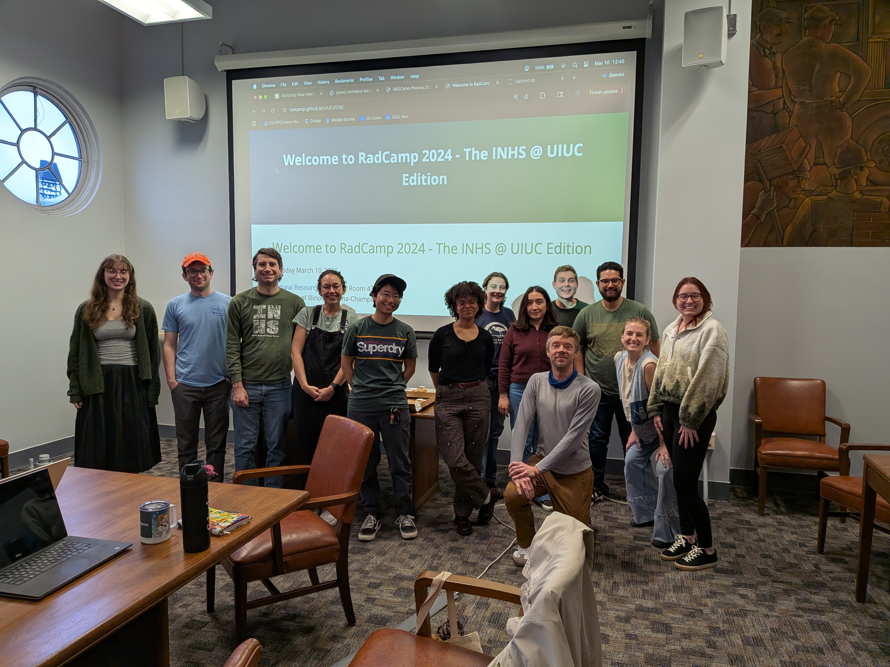

# Welcome to Field-to-Phylogeny 2026 - The Madagascar Edition

November 10-12, 2026  
Association Vahatra (2 days), Mahaliana (1 day)  
Antananarivo, Madagascar

## Organisers, Instructors, and Facilitators

  - Dr Arianna Kuhn (Illinois Natural History Survey; instructor/organizer)
  - Dr Sara Ruane (Field Museum; instructor/organizer)
  - Fandresena Rakotoarimalala (University of Antananarivo; instructor/organizer)
  - Dr Voahangy Soarimalala (Association Vahatra; collaborator)
  - Fidisoa Rasambainarivo (East Carolina University; collaborator)
  - Dr Isaac Overcast (University of Maine; INHS; collaborator)

## Registration

Registration for this edition of Field-to-Phylogeny is **free**, but 
participation will be limited to students enrolled at University of
Antananarivo and participating in the Association Vahatra internship program. 
Please fill out this brief registration survey, so we can get a better idea of who will attend:

[**Register for Field-to-Phylogeny Madagascar 2026**](https://forms.gle/3hPyBJ4kKJkxMiM59)

## Schedule Outline (View the [detailed schedule](https://docs.google.com/spreadsheets/d/113yLp8xCCP2BzPe6VioBBe7qrpIqij_uJ8uj1u2RQao))

Times       | Day 1 (Tue Nov 10) | Day 2 (Wed Nov 11) | Day 3 (Thu Nov 12) |
-----       | ----- | ----- | ----- |
8:30-9:00   | Check-in and refreshments | Check-in and refreshments | Check-in and refreshments |
9:00-12:00  | Intro, Lecture & DNA Extraction Lab | Lecture & Sequence Editing Lab | Lecture & Phylogenetics Lab |
12:00-13:30 | Lunch | Lunch | Lunch |
13:30-17:00 | Lecture & DNA Quantification Lab | Lecture & DNA Barcoding Lab | Phylogenetics Lab (cont.) |

## Refreshments provided and workshop sponsored by:

  

Special thanks to the European Society for Evolutionary Biology for
their support through the Global Evolutionary Biology Initiative program.

## Exit Survey

Don't forget to make an exit survey!
<!--[RADCamp UIUC 2026 Exit Survey](https://docs.google.com/forms/d/1RJ5HRDczQGQkIfNv1QEtk6fbTULx8i6yg2cJ5nFGFCE/edit) -->

## Group Photo

Really don't forget to take a few group photos!
<!--  -->

## Acknowledgements

